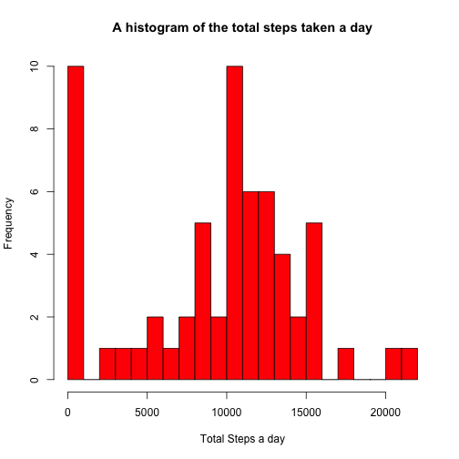
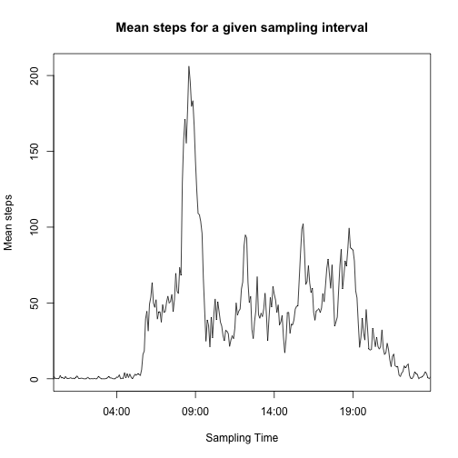
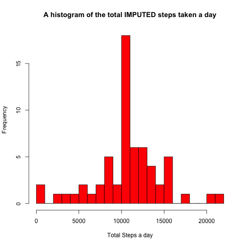
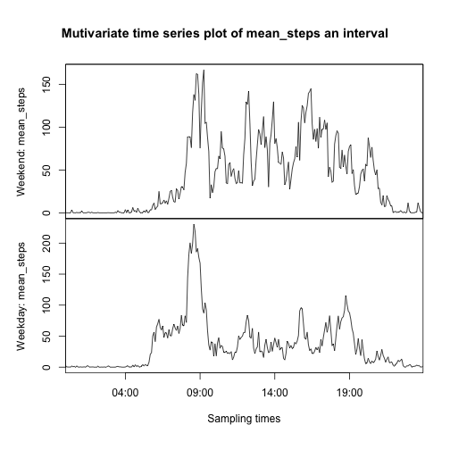

# Loading and preprocessing the data


```r
url_zipped_data = "https://d396qusza40orc.cloudfront.net/repdata%2Fdata%2Factivity.zip"
```

The following code downloads data on the fly from [here] (https://d396qusza40orc.cloudfront.net/repdata%2Fdata%2Factivity.zip) to the data_dir. The unzipped local copy is available at data_dir/activity.csv. 

```r
if (!file.exists("data_dir")) {
    dir.create("data_dir")
}
local_zipped_data = "data_dir/activity.zip"
download.file( url_zipped_data,local_zipped_data,method = "curl")
unzip(local_zipped_data,overwrite = TRUE,exdir="data_dir")
```

The file contents are read into a dataframe. The dataframe is converted to a data table and some exploratory analysis carried out.

```r
require(data.table)
raw_activity_dt = fread("data_dir/activity.csv")
setkeyv(raw_activity_dt,c("date","interval"))

raw_dates = unique(raw_activity_dt[,date])
total_dates = length(raw_dates)

raw_intervals = unique(raw_activity_dt[,interval])
total_intervals = length(raw_intervals)
sampling_interval = raw_intervals[2] - raw_intervals[1]

exploratory_message = paste("With a time interval of ",sampling_interval," minutes the recorded data set is expected to contain ",24*60/sampling_interval," entries per day",sep="")
exploratory_result = "Dataset has the expected number of time interval entries. Note this is just a quick sanity check and does not cover if dates have duplicated and such."

if (sampling_interval * total_intervals != 24*60 ) {
	exploratory_result = "Data is corrupt. Sampling events either exceeds or falls short of expected number."
}
```
A quick sanity check on the data set was carried out. With a time interval of 5 minutes the recorded data set is expected to contain 288 entries per day  
**Dataset has the expected number of time interval entries. Note this is just a quick sanity check and does not cover if dates have duplicated and such.**

# Raw data to tidy data
The dataset with its repeating indices (interval and date) is best stored as a matrix, especially since the raw data was sorted by date and interval after being read in. This has the added advatage of replacing loops or plyr statements with simple row/col sums.

```r
tidy_activity_matrix = matrix(raw_activity_dt[,steps],ncol=total_intervals,nrow=total_dates,byrow=TRUE)
rownames(tidy_activity_matrix) = raw_dates 
colnames(tidy_activity_matrix) = raw_intervals
```

***
# Analyzing data across days

```r
total_steps_given_day = rowSums(tidy_activity_matrix, na.rm = T)
names(total_steps_given_day) = raw_dates
```
The steps taken in a day averaged across all days available is 

```r
mean(total_steps_given_day)
```

```
## [1] 9354.23
```
 The median value of this dataset is 

```r
median(total_steps_given_day)
```

```
## [1] 10395
```
Here is a histogram depicting this data.
***

```r
hist(total_steps_given_day, col="red", main="A histogram of the total steps taken a day",breaks=20,xlab="Total Steps a day")
```

 

# The average daily pattern
The time intervals in the file are not standard date/time object. To correctly plot the average daily pattern these raw intervals are converted to standard date/time objects.

```r
mean_steps_an_interval = colMeans(tidy_activity_matrix,na.rm = T)
zero_padded_interval = sprintf("%04d", raw_intervals)
full_interval_string = paste("1/1/00",paste(substr(zero_padded_interval,1,2),substr(zero_padded_interval,3,4), sep=":"),sep=" ")
tidy_intervals  = strptime(full_interval_string, "%m/%d/%y %H:%M")
```
Here is a plot of the average daily pattern
***

```r
plot(tidy_intervals,mean_steps_an_interval,main="Mean steps for a given sampling interval",xlab = "Sampling Time",ylab = "Mean steps",type="l",xaxs="i")
```

 
***

#### Which 5-minute interval, on average across all the days in the dataset, contains the maximum number of steps?

```r
max_interval = format(tidy_intervals[which(mean_steps_an_interval == max(mean_steps_an_interval))],format="%H:%M")
```
The 08:35 time interval average is the maximum as represented by the peak in the graph.

# Imputing missing values
#### Calculate and report the total number of missing values in the dataset (i.e. the total number of rows with NAs)
There are:

```r
total_NA_values = sum(is.na(tidy_activity_matrix))
```
There are a total of 2304 NA values in the dataset

#### A strategy for filling in all of the missing values in the dataset. 
Imputing missing values is a complicated subject with a lot of theory behind it. The simplest way to impute is to use the mean across similar samples. This is the approach taken here.
implemented in the impute.mean function in the HotDeckImputation package.

#### Create a new dataset that is equal to the original dataset but with the missing data filled in.
The impute strategy described above is implemented in the impute.mean function in the HotDeckImputation package. The impute.mean replaces the NAs with the colmeans.

```r
library('HotDeckImputation')
imputed_activity_matrix = impute.mean(DATA=tidy_activity_matrix)
```

#### Redoing the analysis on the imputated dataset

```r
imputed_total_steps_given_day = rowSums(imputed_activity_matrix, na.rm = T)
names(imputed_total_steps_given_day) = raw_dates
```
Here is a histogram of the imputed data set along with the mean and median calculations.

```r
hist(imputed_total_steps_given_day, col="red", main="A histogram of the total IMPUTED steps taken a day",breaks=20,xlab="Total Steps a day")
```

 

```r
mean_imputed_total_steps_given_day = mean(imputed_total_steps_given_day)
median_imputed_total_steps_given_day = median(imputed_total_steps_given_day)
```
The mean and median of the imputed total steps a day are 1.0766189 &times; 10<sup>4</sup> and 1.0766189 &times; 10<sup>4</sup> respectively. 
Note these are represented in scientific notation.

#### Do these values differ from the estimates from the first part of the assignment? What is the impact of imputing missing data on the estimates of the total daily number of steps?
Yes, they do. This is because I use the mean across the same interval on different days to fill the NA of a given interval. The median and mean both shift.

# Weekend vs Weekdays
#### Create a new factor variable in the dataset with two levels -- "weekday" and "weekend" indicating whether a given date is a weekday or weekend day.
Since the current tidy datset is a numerical matrix it cannot have factors. So I convert the 'tidy' matrix to a 'tidy' dataframe and add the factors column as required by the assignment. 

```r
library('chron')
imputed_activity_df = as.data.frame(imputed_activity_matrix)
weekend_or_not = factor(as.numeric(is.weekend(raw_dates)), labels = c("weekday", "weekend"))
names(weekend_or_not) = raw_dates
imputed_activity_df["what_day"] = weekend_or_not
```
#### Make a panel plot containing a time series plot (i.e. type = "l") of the 5-minute interval (x-axis) and the average number of steps taken, averaged across all weekday days or weekend days (y-axis).

```r
imputed_activity_Wday = subset(imputed_activity_df, what_day == "weekday")
imputed_activity_Wend = subset(imputed_activity_df, what_day == "weekend")
```
These subset dataframes still have the weekend/weekday column. I delete these so I can treat these just like I would matrices and revert to colMeans as earlier.

```r
imputed_activity_Wday$what_day = NULL
imputed_activity_Wend$what_day = NULL
imputed_activity_Wday_mean_steps_an_interval = colMeans(imputed_activity_Wday)
imputed_activity_Wend_mean_steps_an_interval = colMeans(imputed_activity_Wend)
```
The above vectors have all the data I need. I could plot these as I have plotted the non-imputed data earlier. As a learning exercise I adopt the following instead.
Time series plots occur in all sorts of cases and converting this data to a time series object seemed to me as a valuable exercise. So this is the route I took. There are several packages to help with mvts{multi variate time series} analysis including one authored by none other than Prof. Peng. All of this was discovered through extensive googling.

```r
library('xts')
combined_timeseries_mean_steps = xts(cbind(imputed_activity_Wend_mean_steps_an_interval,imputed_activity_Wday_mean_steps_an_interval),tidy_intervals)
```
Now I have a multivariate time series object with the correct time intervals attaches as date objects. "xtsExtra" package has a plot.xts function that would have made plotting mvts easy but unfortunately is not compatible with the version of R installed on my mac. 
So I use the facilities from the zoo package {which was loaded as a dependency of the xts package)

```r
combined_timeseries_mean_steps.zoo = as.zoo(combined_timeseries_mean_steps)
plot(combined_timeseries_mean_steps.zoo,main = "Mutivariate time series plot of mean_steps an interval",xlab = "Sampling times",ylab = list( "Weekend: mean_steps", "Weekday: mean_steps"),xaxs='i')
```

 
